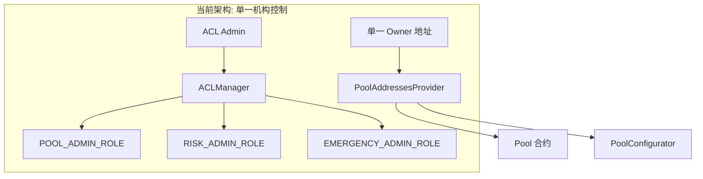
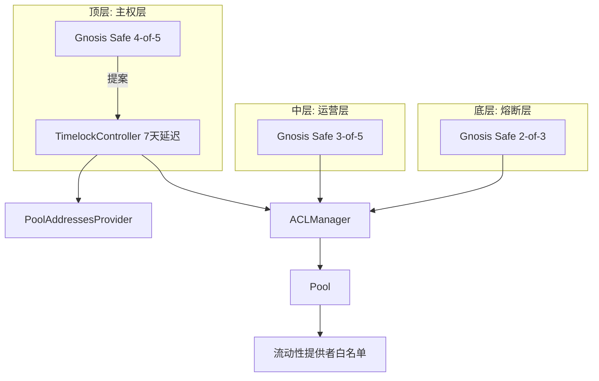

# Aave 协议权限去中心化改造方案

## 当前架构分析

当前 Aave V3 权限架构如下：



**关键权限点**：

1. [`PoolAddressesProvider.sol`](src/contracts/protocol/configuration/PoolAddressesProvider.sol) - 继承 `Ownable`，所有关键函数使用 `onlyOwner` 修饰符
2. [`ACLManager.sol`](src/contracts/protocol/configuration/ACLManager.sol) - 基于 OpenZeppelin `AccessControl`，`DEFAULT_ADMIN_ROLE` 拥有最高权限
3. [`Pool.sol`](src/contracts/protocol/pool/Pool.sol) - `supply()` 函数无限制，任何人都可以提供流动性

## 目标架构设计




## 核心改造内容

### 1. 流动性提供者白名单机制

**修改文件**:

- [`src/contracts/protocol/pool/PoolStorage.sol`](src/contracts/protocol/pool/PoolStorage.sol)
- [`src/contracts/protocol/pool/Pool.sol`](src/contracts/protocol/pool/Pool.sol)
- [`src/contracts/interfaces/IPool.sol`](src/contracts/interfaces/IPool.sol)
```solidity
// PoolStorage.sol - 添加白名单存储
mapping(address => bool) internal _liquidityProviderWhitelist;

// Pool.sol - 添加修饰符和管理函数
modifier onlyLiquidityProvider() {
    require(_liquidityProviderWhitelist[msg.sender], Errors.CallerNotLiquidityProvider());
    _;
}

function supply(...) public virtual override onlyLiquidityProvider { ... }
function addLiquidityProvider(address provider) external onlyPoolAdmin { ... }
function removeLiquidityProvider(address provider) external onlyPoolAdmin { ... }
```


### 2. Timelock 集成

**新增文件**:

- `src/contracts/protocol/configuration/TimelockRoleManager.sol`

**修改文件**:

- [`src/contracts/protocol/configuration/PoolAddressesProvider.sol`](src/contracts/protocol/configuration/PoolAddressesProvider.sol) - 关键配置函数改为 `onlyTimelock`
- [`src/contracts/protocol/configuration/ACLManager.sol`](src/contracts/protocol/configuration/ACLManager.sol) - 角色管理函数改为 `onlyTimelock`

### 3. 多签钱包适配器

**新增文件**:

- `src/contracts/protocol/configuration/MultisigRoleAdapter.sol`
- `src/contracts/interfaces/IMultisigRoleAdapter.sol`

用于将 Gnosis Safe 多签钱包地址映射到 Aave 角色，实现"合约嵌套"式的去中心化控制。

### 4. 错误和事件定义

**修改文件**:

- [`src/contracts/protocol/libraries/helpers/Errors.sol`](src/contracts/protocol/libraries/helpers/Errors.sol)
```solidity
error CallerNotTimelock();
error CallerNotLiquidityProvider();
```


## 三层权限配置

| 层级 | 角色 | 多签配置 | Timelock | 操作范围 ||------|------|----------|----------|----------|| 顶层 | DEFAULT_ADMIN_ROLE | 4-of-5 | 7天 | 合约升级、预言机更换、管理员增删 || 中层 | POOL_ADMIN/RISK_ADMIN | 3-of-5 | 无 | 利率调整、LTV配置、借贷上限 || 底层 | EMERGENCY_ADMIN | 2-of-3 | 无 | 紧急暂停、熔断操作 |

## 部署流程

1. 部署 3 个 Gnosis Safe 多签钱包（顶层、中层、底层）
2. 部署 OpenZeppelin TimelockController（minDelay: 7天）
3. 部署 MultisigRoleAdapter
4. 升级 ACLManager 集成多签适配器
5. 将 PoolAddressesProvider 的 owner 转移给 Timelock
6. 配置初始流动性提供者白名单

## 文件修改清单

### 核心合约修改

1. `src/contracts/protocol/pool/PoolStorage.sol` - 添加白名单存储
2. `src/contracts/protocol/pool/Pool.sol` - 添加白名单检查和管理
3. `src/contracts/protocol/configuration/PoolAddressesProvider.sol` - Timelock 集成
4. `src/contracts/protocol/configuration/ACLManager.sol` - 多签适配器集成
5. `src/contracts/protocol/libraries/helpers/Errors.sol` - 新增错误定义

### 新增文件