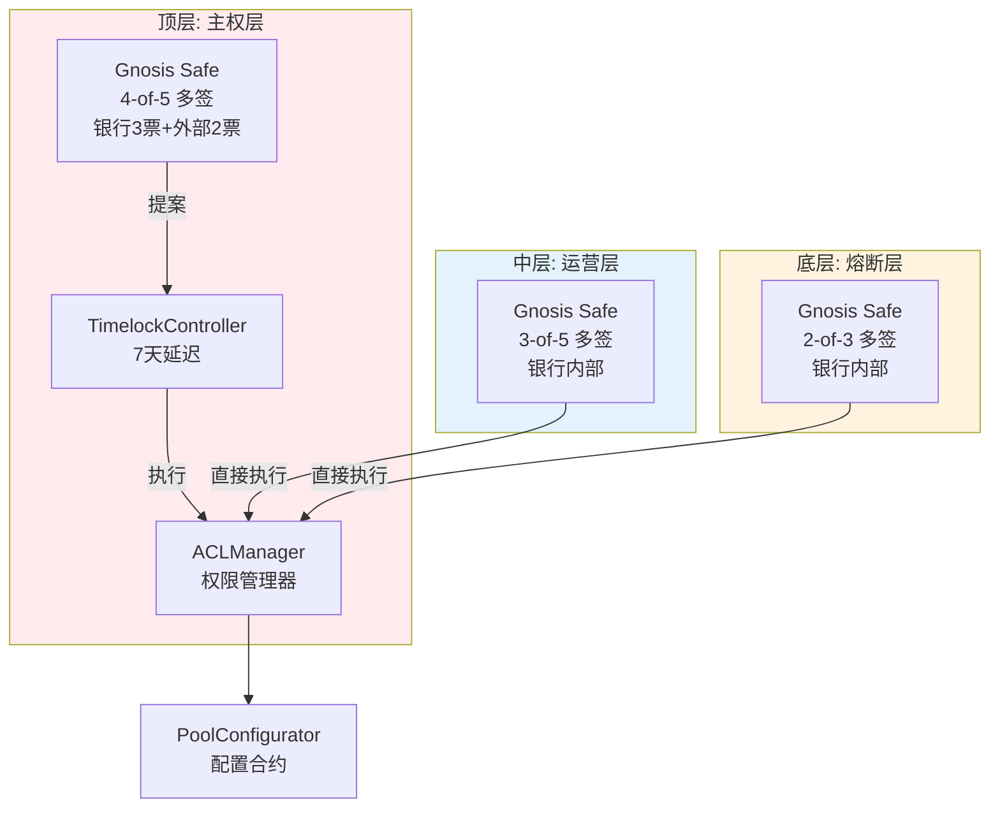

# 三层权限架构实现方案

## 架构概述

基于三原则设计的三层权限架构：

1. **顶层（主权层）**：DEFAULT_ADMIN_ROLE，5票中需4票（3+2模式），带Timelock延迟（7天）
2. **中层（运营层）**：RISK_ADMIN_ROLE & POOL_ADMIN_ROLE，5票中需3票（银行内部），无延迟
3. **底层（熔断层）**：EMERGENCY_ADMIN_ROLE，2-of-3（银行内部），无延迟

## 技术决策

| 决策点 | 选择 | 理由 ||--------|------|------|| 多签钱包方案 | Gnosis Safe | 成熟稳定，广泛采用，支持多版本兼容（v1.3/v1.4） || 权限验证方式 | 地址映射 + msg.sender检查 | Safe内部已完成签名验证，只需检查调用者地址，Gas成本低 || Timelock延迟时长 | 7天（604800秒） | 为顶层操作提供充分审查窗口，防止恶意操作 || 顶层多签阈值 | 4-of-5（银行3+外部2） | 确保银行无法单独执行，必须获得至少1家外部机构支持 || 中层多签阈值 | 3-of-5（银行内部） | 跨部门审批保证安全，同时保证响应速度 || 底层多签阈值 | 2-of-3（银行内部） | 快速响应紧急情况，防止单点故障 || 接口抽象方式 | ISafe接口 | 不依赖具体Safe实现，支持版本升级和测试Mock || 权限检查优先级 | 多签钱包 > AccessControl | 优先检查多签，回退到标准角色检查，保持向后兼容 |

## 架构流程图




## 核心组件设计

### 1. MultisigRoleAdapter - 多签钱包适配器

**文件**: `src/contracts/protocol/configuration/MultisigRoleAdapter.sol`**职责**：

- 将Gnosis Safe地址映射到Aave角色
- 实现多签钱包权限检查逻辑
- 支持兼容多个Safe版本（通过接口抽象）

**关键功能**：

```solidity
interface IMultisigRoleAdapter {
    function setRoleMultisig(bytes32 role, address multisig) external;
    function hasRole(bytes32 role, address account) external view returns (bool);
    function getRoleMultisig(bytes32 role) external view returns (address);
}
```

**实现要点**：

- 存储每个角色对应的Gnosis Safe地址映射
- `hasRole`检查：当`msg.sender == multisig`时返回true（Safe已内部验证签名）
- 设置函数仅DEFAULT_ADMIN_ROLE可调用
- 兼容Safe v1.3和v1.4（通过接口抽象，不依赖具体实现）

### 2. ITimelockController - Timelock控制器接口

**文件**: `src/contracts/dependencies/openzeppelin/contracts/governance/ITimelockController.sol`**职责**：

- 定义TimelockController合约的接口规范
- 提供延迟执行机制的抽象层
- 支持测试和集成（可通过Mock实现）

**接口定义**：

```solidity
interface ITimelockController {
  // 角色常量
  function PROPOSER_ROLE() external view returns (bytes32);
  function EXECUTOR_ROLE() external view returns (bytes32);
  function CANCELLER_ROLE() external view returns (bytes32);

  // 权限检查
  function hasRole(bytes32 role, address account) external view returns (bool);
  
  // 延迟配置
  function getMinDelay() external view returns (uint256);
  
  // 操作管理
  function hashOperation(
    address target,
    uint256 value,
    bytes calldata data,
    bytes32 predecessor,
    bytes32 salt
  ) external pure returns (bytes32);
  
  function schedule(
    address target,
    uint256 value,
    bytes calldata data,
    bytes32 predecessor,
    bytes32 salt,
    uint256 delay
  ) external;
  
  function execute(
    address target,
    uint256 value,
    bytes calldata payload,
    bytes32 predecessor,
    bytes32 salt
  ) external payable;
}
```

**实现要点**：

- **PROPOSER_ROLE**: 顶层多签钱包拥有此角色，可以调度操作
- **EXECUTOR_ROLE**: 执行者角色，可以执行已到期的操作（可设置为公开执行）
- **CANCELLER_ROLE**: 取消者角色，可以取消待执行的操作
- **getMinDelay()**: 返回最小延迟时间（7天 = 604800秒）
- **hashOperation()**: 生成操作的唯一标识符，用于跟踪操作状态
- **schedule()**: 调度操作，设置延迟时间（必须 >= minDelay）
- **execute()**: 执行已到期的操作

**使用场景**：

- 顶层操作必须通过Timelock延迟执行
- 提供7天审查窗口，防止恶意操作
- 支持操作取消机制

**实现来源**：

- 实际实现：OpenZeppelin的`TimelockController`合约（位于依赖库中）
- 测试实现：`tests/mocks/MockTimelockController.sol`

### 3. TimelockRoleManager - Timelock集成管理器

**文件**: `src/contracts/protocol/configuration/TimelockRoleManager.sol`**职责**：

- 为顶层操作封装Timelock延迟执行
- 确保所有DEFAULT_ADMIN_ROLE操作必须通过Timelock

**关键功能**：

```solidity
interface ITimelockRoleManager {
    function queueRoleChange(
        bytes32 role,
        address account,
        bool grant
    ) external returns (bytes32);
    function executeRoleChange(
        bytes32 role,
        address account,
        bool grant
    ) external;
}
```

**实现要点**：

- 顶层多签钱包作为PROPOSER_ROLE
- TimelockController作为EXECUTOR_ROLE
- 最小延迟：7天（604800秒）
- 所有顶层操作必须通过`queue` -> `execute`流程

### 4. 修改ACLManager - 集成多签适配器

**文件**: `src/contracts/protocol/configuration/ACLManager.sol`**关键修改**：

- 添加`MultisigRoleAdapter`实例引用
- 修改所有`is*Admin`函数，优先检查多签钱包
- 添加`onlyTimelock`修饰符用于顶层操作
- 保持向后兼容（支持传统单签地址）

**修改示例**：

```solidity
function isPoolAdmin(address admin) external view override returns (bool) {
    // 优先检查多签钱包
    if (multisigAdapter.hasRole(POOL_ADMIN_ROLE, admin)) {
        return true;
    }
    // 回退到标准AccessControl检查
    return hasRole(POOL_ADMIN_ROLE, admin);
}
```


### 5. 修改PoolConfigurator - 支持多签调用

**文件**: `src/contracts/protocol/pool/PoolConfigurator.sol`**关键修改**：

- 无需修改（已通过ACLManager间接支持）
- 确保`_onlyPoolAdmin`等函数能正确识别多签钱包调用

### 6. 部署脚本

**文件**: `src/deployments/scripts/DeployMultisigAccessControl.s.sol`**部署流程**：

1. 部署3个Gnosis Safe钱包（顶层、中层、底层）
2. 配置多签成员和阈值：

- 顶层：5成员，阈值4（银行3+外部2）
- 中层：5成员，阈值3（银行内部）
- 底层：3成员，阈值2（银行内部）

3. 部署TimelockController（顶层使用，7天延迟）
4. 部署MultisigRoleAdapter
5. 部署/升级ACLManager（集成适配器）
6. 初始化多签钱包地址到角色映射
7. 将DEFAULT_ADMIN_ROLE的PROPOSER_ROLE授予顶层多签钱包
8. 将DEFAULT_ADMIN_ROLE转移给TimelockController

## 权限层级详细设计

### 顶层（主权层）- DEFAULT_ADMIN_ROLE

**控制实体**：3+2混合多签钱包（4-of-5）

- 银行内部：3票（CEO, CTO, 首席合规官）
- 外部信任锚：2票（代码审计公司、持牌信托/律所）
- 执行门槛：4票（确保银行无法单独执行）

**Timelock延迟**：7天（604800秒）**操作范围**：

- 合约升级（通过PoolAddressesProvider）
- 预言机更换
- 储备金提取
- 管理员增删（addPoolAdmin, addRiskAdmin等）
- 角色管理（setRoleAdmin）

**安全保证**：

- 银行3票 < 4票阈值，无法单独执行
- 必须获得至少1家外部机构签名
- 7天延迟提供审查和撤销时间窗口

### 中层（运营层）- RISK_ADMIN_ROLE & POOL_ADMIN_ROLE

**控制实体**：银行内部多签（3-of-5）

- 成员：资产负债部(2人)、风险管理部(2人)、运营部(1人)
- 执行门槛：3票

**Timelock延迟**：无（直接执行）**操作范围**：

- 利率曲线调整（setReserveInterestRateStrategyAddress）
- LTV调整（setLtv, setLiquidationThreshold）
- 借贷上限调整（setSupplyCap, setBorrowCap）
- 储备金配置（setReserveFactor, setReserveActive）

**安全保证**：

- 银行内部跨部门审批
- 无需外部机构介入，提高响应速度
- 无法执行顶层操作（合约升级、预言机更换等）

### 底层（熔断层）- EMERGENCY_ADMIN_ROLE

**控制实体**：银行内部多签（2-of-3）

- 成员：银行首席风控官(CRO)、7x24小时监控中心、应急响应负责人
- 执行门槛：2票

**Timelock延迟**：无（立即执行）**操作范围**：

- 协议暂停（setReservePause）
- 紧急冻结（setReserveFreeze）
- 清算宽限期管理（setLiquidationGracePeriod）

**安全保证**：

- 快速响应，需要2人确认后执行
- 只能暂停，不能修改配置
- 2-of-3阈值确保不会因单点故障而无法响应，同时防止单点误操作

## 技术实现细节

### 多签钱包验证机制

**原理**：

- Gnosis Safe在执行交易前已完成多签签名验证
- 我们只需检查`msg.sender == multisig`即可
- 无需额外的签名验证函数，降低Gas成本

**实现**：

```solidity
function hasRole(bytes32 role, address account) external view returns (bool) {
    address multisig = roleMultisigs[role];
    if (multisig != address(0) && account == multisig) {
        // 检查是否为多签钱包的直接调用
        // Safe内部已经完成了多签验证
        return msg.sender == multisig;
    }
    // 回退到标准AccessControl检查
    return ACL_MANAGER.hasRole(role, account);
}
```


### Gnosis Safe接口抽象

**设计**：

- 不依赖具体Safe版本实现
- 通过接口抽象支持Safe v1.3和v1.4
- 仅使用通用的`execTransaction`接口

**接口定义**：

```solidity
interface ISafe {
    function getThreshold() external view returns (uint256);
    function getOwners() external view returns (address[] memory);
}
```


### Timelock集成

**流程**：

1. 顶层多签钱包创建提案（通过`ITimelockController.schedule()`调度操作）
2. 等待7天延迟（`getMinDelay()`返回604800秒）
3. TimelockController执行操作（通过`ITimelockController.execute()`）
4. 操作生效

**关键配置**：

- **PROPOSER_ROLE**：顶层多签钱包（4-of-5），拥有调度操作的权限
- **EXECUTOR_ROLE**：TimelockController自身或公开执行（`address(0)`表示任何人都可以执行）
- **CANCELLER_ROLE**：顶层多签钱包（可取消待执行操作）
- **最小延迟**：7天（604800秒），通过`getMinDelay()`获取

**接口使用**：

```solidity
// 1. 检查调用者是否有PROPOSER_ROLE
ITimelockController timelock;
require(timelock.hasRole(timelock.PROPOSER_ROLE(), msg.sender), "NOT_PROPOSER");

// 2. 生成操作ID
bytes32 operationId = timelock.hashOperation(target, value, data, predecessor, salt);

// 3. 调度操作（设置7天延迟）
timelock.schedule(target, value, data, predecessor, salt, 7 days);

// 4. 执行操作（7天后）
timelock.execute(target, value, payload, predecessor, salt);
```

**操作状态**：

- **Unset**: 操作尚未调度
- **Waiting**: 操作已调度，等待延迟到期
- **Ready**: 延迟已到期，可以执行
- **Done**: 操作已执行完成

## 文件清单

### 新增文件

1. `src/contracts/protocol/configuration/MultisigRoleAdapter.sol` - 多签钱包适配器
2. `src/contracts/protocol/configuration/TimelockRoleManager.sol` - Timelock集成管理器
3. `src/contracts/interfaces/IMultisigRoleAdapter.sol` - 多签适配器接口
4. `src/contracts/interfaces/ITimelockRoleManager.sol` - Timelock管理器接口
5. `src/contracts/interfaces/ISafe.sol` - Gnosis Safe接口抽象
6. `src/contracts/dependencies/openzeppelin/contracts/governance/ITimelockController.sol` - TimelockController接口定义
7. `src/deployments/scripts/DeployMultisigAccessControl.s.sol` - 部署脚本
8. `tests/protocol/configuration/MultisigRoleAdapter.t.sol` - 多签适配器测试
9. `tests/protocol/configuration/TimelockRoleManager.t.sol` - Timelock管理器测试
10. `tests/integration/MultisigAccessControl.t.sol` - 集成测试
11. `tests/mocks/MockTimelockController.sol` - TimelockController Mock实现（用于测试）

### 修改文件

1. `src/contracts/protocol/configuration/ACLManager.sol` - 集成多签适配器
2. `src/contracts/interfaces/IACLManager.sol` - 添加多签相关接口（如需要）

## 测试要求

### 单元测试

1. **MultisigRoleAdapter测试**：

- 测试角色到多签钱包的映射
- 测试权限检查逻辑（多签钱包调用）
- 测试回退到标准AccessControl
- 测试设置权限（仅DEFAULT_ADMIN_ROLE）

2. **TimelockRoleManager测试**：

- 测试队列操作（queueRoleChange）
- 测试延迟执行（executeRoleChange）
- 测试取消操作
- 测试最小延迟验证

### 集成测试

1. **多签钱包调用测试**：

- 通过Gnosis Safe执行管理员操作
- 验证多签阈值检查
- 验证权限正确识别

2. **Timelock延迟测试**：

- 验证顶层操作必须通过Timelock
- 验证延迟时间（7天）
- 验证取消机制

3. **安全测试**：

- 验证银行无法单独控制顶层操作（3票 < 4票）
- 验证中层操作无需外部机构
- 验证底层操作可立即执行

## 安全考虑

1. **防止单点控制**：顶层4-of-5阈值确保银行（3票）无法单独执行
2. **职责分离**：不同层级由不同多签钱包控制，互不干扰
3. **显性授权**：所有操作都需要链上签名，不可抵赖
4. **最小权限**：日常运营只需中层权限，顶层权限通过Timelock延迟
5. **向后兼容**：保持现有接口不变，支持传统单签地址
6. **Gas优化**：多签验证仅检查地址匹配，不增加额外Gas成本

## 部署检查清单

- [ ] 部署3个Gnosis Safe钱包并配置成员和阈值
- [ ] 部署TimelockController并配置延迟（7天）
- [ ] 部署MultisigRoleAdapter
- [ ] 部署/升级ACLManager（集成适配器）
- [ ] 初始化多签钱包地址到角色映射
- [ ] 配置Timelock角色（PROPOSER, EXECUTOR, CANCELLER）
- [ ] 转移DEFAULT_ADMIN_ROLE给TimelockController
- [ ] 验证权限检查正常工作