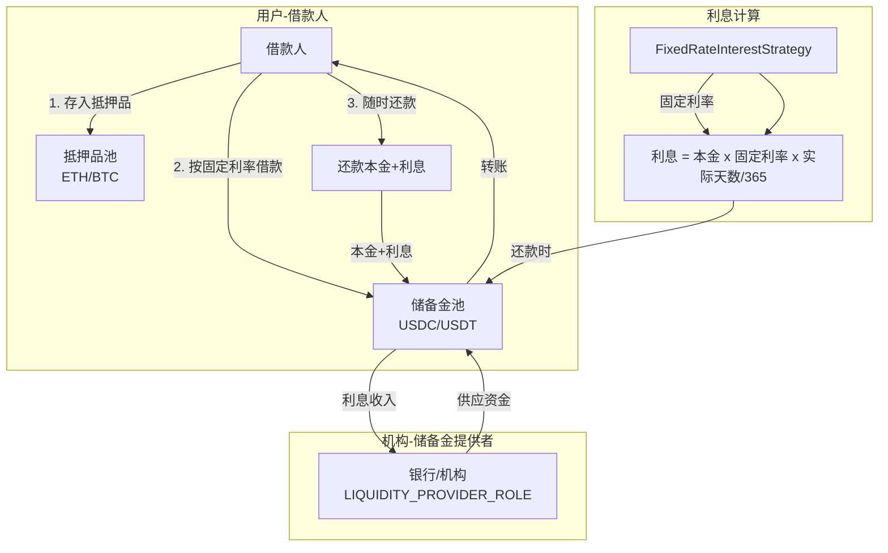
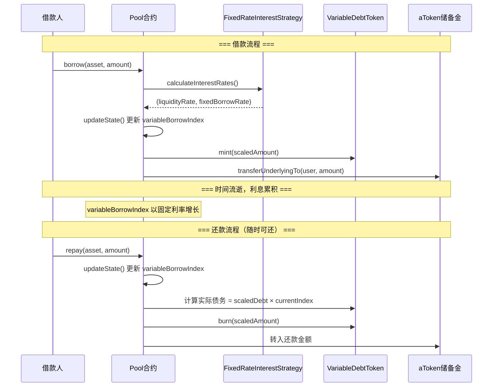

# 固定利率储备金借贷改造方案

## 1. 需求概述

| 特性 | 设计 ||-----|------|| 资金来源 | 单一储备金模式 - 机构向储备金注入资金 || 抵押品机制 | 保留 - 用户需存入抵押品才能借款 || 利率模式 | 固定利率 - 不依赖资金池利用率 || 期限结构 | 无固定期限 - 可随时还款，按实际天数计息 |

## 2. 当前架构 vs 目标架构

### 当前 Aave V3 利率机制

- **浮动利率**：基于资金池利用率（`utilization = debt / (liquidity + debt)`）动态计算
- **利率曲线**：`rate = baseRate + slope1 * utilization`（超过最优利用率后斜率更高）
- **全局利息指数**：`variableBorrowIndex` 累积所有债务利息
- **流动性来源**：多个供应者向资金池提供流动性

### 目标架构




## 3. 核心设计决策

| 特性 | 当前 Aave | 改造后 ||-----|----------|-------|| 利率模式 | 浮动（基于利用率） | 固定（管理员设定） || 资金来源 | 多供应者资金池 | 单一机构储备金 || 利息计算 | 全局 variableBorrowIndex | 固定利率 × 实际天数 || 抵押品 | 保留 | 保留 || 还款期限 | 无 | 无（可随时还款） |**关键决策**：继续使用 `variableBorrowIndex` 机制追踪债务原因：

1. 最小化代码改动
2. 固定利率下，`variableBorrowIndex` 以固定速率增长
3. 现有的 `balanceOf()`、`totalSupply()` 计算无需修改

利息累积公式：

```javascript
newIndex = oldIndex × (1 + fixedRate × deltaTime / SECONDS_PER_YEAR)
userDebt = scaledDebt × currentIndex
```


## 4. 核心组件设计

### 4.1 FixedRateInterestStrategy - 固定利率策略

**新建文件**: `src/contracts/misc/FixedRateInterestStrategy.sol`核心功能：

- 返回固定的借款利率，不依赖利用率
- 管理员可以调整固定利率
- 供应利率 = 借款利率 × 利用率 × (1 - reserveFactor)
```solidity
contract FixedRateInterestStrategy is IReserveInterestRateStrategy {
    IPoolAddressesProvider public immutable ADDRESSES_PROVIDER;
    
    // 固定借款利率（bps 格式，1000 = 10%）
    mapping(address => uint16) internal _fixedBorrowRate;
    
    modifier onlyPoolConfigurator() {
        require(
            msg.sender == ADDRESSES_PROVIDER.getPoolConfigurator(),
            Errors.CallerNotPoolConfigurator()
        );
        _;
    }
    
    /// @notice 返回固定利率，不考虑利用率
    function calculateInterestRates(
        DataTypes.CalculateInterestRatesParams calldata params
    ) external view returns (uint256 liquidityRate, uint256 borrowRate) {
        borrowRate = _bpsToRay(_fixedBorrowRate[params.reserve]);
        
        // 供应利率仍基于实际利用情况分配利息给储备金提供者
        if (params.totalDebt > 0 && params.virtualUnderlyingBalance > 0) {
            uint256 utilization = params.totalDebt.rayDiv(
                params.virtualUnderlyingBalance + params.totalDebt
            );
            liquidityRate = borrowRate
                .rayMul(utilization)
                .percentMul(PercentageMath.PERCENTAGE_FACTOR - params.reserveFactor);
        }
        return (liquidityRate, borrowRate);
    }
    
    /// @notice 设置资产的固定借款利率
    /// @param reserve 资产地址
    /// @param rate 年化利率（bps），如 1000 = 10%
    function setFixedBorrowRate(
        address reserve, 
        uint16 rate
    ) external onlyPoolConfigurator {
        require(rate <= 10000, "Rate exceeds 100%");
        _fixedBorrowRate[reserve] = rate;
        emit FixedBorrowRateSet(reserve, rate);
    }
    
    function getFixedBorrowRate(address reserve) external view returns (uint256) {
        return _bpsToRay(_fixedBorrowRate[reserve]);
    }
    
    function _bpsToRay(uint256 n) internal pure returns (uint256) {
        return n * 1e23; // bps to ray
    }
}
```


### 4.2 单一供应者权限控制

**修改文件**: `src/contracts/protocol/configuration/ACLManager.sol`

```solidity
bytes32 public constant LIQUIDITY_PROVIDER_ROLE = keccak256('LIQUIDITY_PROVIDER');

function addLiquidityProvider(address provider) external onlyRole(DEFAULT_ADMIN_ROLE) {
    _grantRole(LIQUIDITY_PROVIDER_ROLE, provider);
}

function removeLiquidityProvider(address provider) external onlyRole(DEFAULT_ADMIN_ROLE) {
    _revokeRole(LIQUIDITY_PROVIDER_ROLE, provider);
}

function isLiquidityProvider(address provider) external view returns (bool) {
    return hasRole(LIQUIDITY_PROVIDER_ROLE, provider);
}
```


### 4.3 ReserveConfiguration - 添加 borrowableOnly 标志

**修改文件**: `src/contracts/protocol/libraries/configuration/ReserveConfiguration.sol`

```solidity
// 使用 bit 253（之前未使用）作为 borrowableOnly 标志
uint256 internal constant BORROWABLE_ONLY_MASK = 0x2000000000000000000000000000000000000000000000000000000000000000;
uint256 internal constant BORROWABLE_ONLY_START_BIT_POSITION = 253;

function setBorrowableOnly(
    DataTypes.ReserveConfigurationMap memory self,
    bool borrowableOnly
) internal pure {
    self.data = (self.data & ~BORROWABLE_ONLY_MASK) | 
        (uint256(borrowableOnly ? 1 : 0) << BORROWABLE_ONLY_START_BIT_POSITION);
}

function getBorrowableOnly(
    DataTypes.ReserveConfigurationMap memory self
) internal pure returns (bool) {
    return (self.data & BORROWABLE_ONLY_MASK) != 0;
}
```


### 4.4 ValidationLogic - 添加供应权限验证

**修改文件**: `src/contracts/protocol/libraries/logic/ValidationLogic.sol`

```solidity
bytes32 public constant LIQUIDITY_PROVIDER_ROLE = keccak256('LIQUIDITY_PROVIDER');

function validateSupply(
    DataTypes.ReserveCache memory reserveCache,
    DataTypes.ReserveData storage reserve,
    uint256 scaledAmount,
    address onBehalfOf,
    address sender,           // 新增参数
    address aclManager        // 新增参数
) internal view {
    // 现有验证逻辑...
    
    // 新增：如果是 borrowableOnly 资产，检查供应者角色
    if (reserveCache.reserveConfiguration.getBorrowableOnly()) {
        require(
            IACLManager(aclManager).hasRole(LIQUIDITY_PROVIDER_ROLE, sender),
            Errors.CallerNotLiquidityProvider()
        );
    }
}
```


### 4.5 PoolConfigurator - 添加配置函数

**修改文件**: `src/contracts/protocol/pool/PoolConfigurator.sol`

```solidity
/// @notice 设置资产的固定借款利率
function setFixedBorrowRate(
    address asset,
    uint16 rate
) external onlyPoolAdmin {
    IFixedRateInterestStrategy(
        _pool.getReserveInterestRateStrategyAddress()
    ).setFixedBorrowRate(asset, rate);
    emit FixedBorrowRateSet(asset, rate);
}

/// @notice 设置资产为仅可借资产（仅机构可供应）
function setReserveBorrowableOnly(
    address asset,
    bool borrowableOnly
) external onlyPoolAdmin {
    DataTypes.ReserveConfigurationMap memory currentConfig = _pool.getConfiguration(asset);
    currentConfig.setBorrowableOnly(borrowableOnly);
    _pool.setConfiguration(asset, currentConfig);
    emit ReserveBorrowableOnlyChanged(asset, borrowableOnly);
}
```


## 5. 利息计算流程




## 6. 文件变更清单

### 新增文件

| 文件路径 | 说明 ||---------|------|| `src/contracts/misc/FixedRateInterestStrategy.sol` | 固定利率策略合约 || `src/contracts/interfaces/IFixedRateInterestStrategy.sol` | 固定利率策略接口 || `tests/protocol/fixed-rate/FixedRateStrategy.t.sol` | 利率策略测试 || `tests/protocol/fixed-rate/FixedRateBorrow.t.sol` | 借款流程测试 |

### 修改文件

| 文件路径 | 修改说明 ||---------|---------|| `src/contracts/protocol/configuration/ACLManager.sol` | 添加 LIQUIDITY_PROVIDER_ROLE || `src/contracts/interfaces/IACLManager.sol` | 添加接口定义 || `src/contracts/protocol/libraries/configuration/ReserveConfiguration.sol` | 添加 borrowableOnly 标志 || `src/contracts/protocol/libraries/logic/ValidationLogic.sol` | 添加供应权限检查 || `src/contracts/protocol/libraries/logic/SupplyLogic.sol` | 传递额外参数到 validateSupply || `src/contracts/protocol/pool/Pool.sol` | 传递额外参数 || `src/contracts/protocol/pool/PoolConfigurator.sol` | 添加 setFixedBorrowRate 和 setBorrowableOnly || `src/contracts/interfaces/IPoolConfigurator.sol` | 添加配置接口 || `src/contracts/protocol/libraries/helpers/Errors.sol` | 添加新错误类型 |

## 7. 部署和配置流程

1. **部署 FixedRateInterestStrategy**
   ```solidity
                     FixedRateInterestStrategy strategy = new FixedRateInterestStrategy(addressesProvider);
   ```


2. **部署/升级 Pool 使用新策略**
   ```solidity
                     // Pool 构造函数接受 interestRateStrategy 参数
                     Pool pool = new Pool(addressesProvider, strategy);
   ```


3. **配置资产固定利率**
   ```solidity
                     // 设置 USDC 的固定借款利率为 10% APR
                     poolConfigurator.setFixedBorrowRate(USDC, 1000); // 1000 bps = 10%
   ```


4. **配置单一供应者权限**
   ```solidity
                     // 授予机构 LIQUIDITY_PROVIDER_ROLE
                     aclManager.addLiquidityProvider(institutionAddress);
                     
                     // 设置 USDC 为 borrowableOnly（仅机构可供应）
                     poolConfigurator.setReserveBorrowableOnly(USDC, true);
   ```


5. **机构注入资金**
   ```solidity
                     // 机构向储备金池供应 USDC
                     pool.supply(USDC, amount, institutionAddress, 0);
   ```


## 8. 资产配置策略

| 资产类型 | borrowableOnly | 谁可以供应 | 用途 ||---------|----------------|-----------|------|| USDC    | true           | 仅机构     | 可借资产（储备金） || USDT    | true           | 仅机构     | 可借资产（储备金） || ETH     | false          | 任何人     | 抵押品 || WBTC    | false          | 任何人     | 抵押品 |

## 9. 与现有改造方案的集成

本方案与之前规划的改造完全兼容：| 方案 | 集成点 ||-----|-------|| 单一流动性提供者 | 复用 LIQUIDITY_PROVIDER_ROLE 和 borrowableOnly 标志 || 权限去中心化 | 利率配置受 Timelock/多签控制 |

## 10. 安全考虑

1. **利率锁定风险**：固定利率由管理员设定，需要治理机制防止滥用
2. **资金充足性**：借款前需验证储备金余额足够
3. **精度处理**：使用 ray (27位精度) 进行利息计算
4. **访问控制**：利率配置仅 PoolConfigurator 可调用
5. **向后兼容**：不影响使用原浮动利率的资产

## 11. 关键实现细节

### 利息累积精度

```solidity
// MathUtils.sol 中的复利计算保持不变
// 由于使用固定利率，variableBorrowIndex 将以固定速率增长
function calculateCompoundedInterest(
    uint256 rate,           // 固定利率
    uint40 lastUpdateTimestamp
) internal view returns (uint256) {
    uint256 exp = block.timestamp - uint256(lastUpdateTimestamp);
    uint256 x = (rate * exp) / SECONDS_PER_YEAR;
    return WadRayMath.RAY + x + x.rayMul(x / 2 + x.rayMul(x / 6));
}
```


### 供应利率分配

即使借款利率固定，供应利率仍基于利用率分配利息给储备金提供者：

```javascript
supplierInterest = borrowerInterest × (1 - reserveFactor)
liquidityRate = fixedBorrowRate × utilization × (1 - reserveFactor)
```


### 用户借款示例

```solidity
// 用户存入 10 ETH 作为抵押品
pool.supply(ETH, 10 ether, user, 0);

// 用户借出 5000 USDC（固定利率 10% APR）
pool.borrow(USDC, 5000e6, 2, 0, user);

// 30 天后还款
// 利息 ≈ 5000 × 10% × 30/365 ≈ 41.10 USDC
pool.repay(USDC, type(uint256).max, 2, user);


```