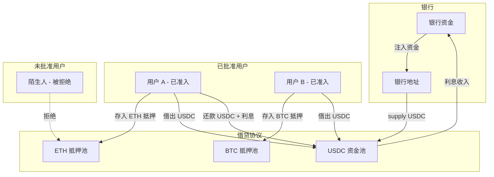
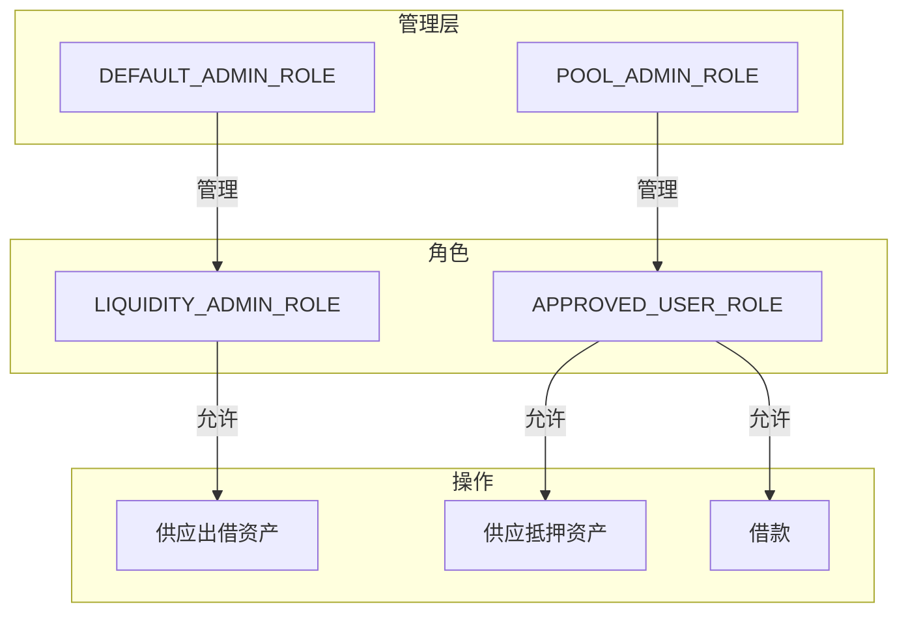
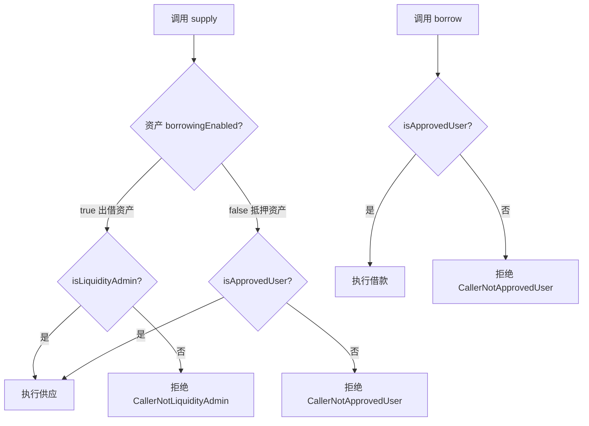
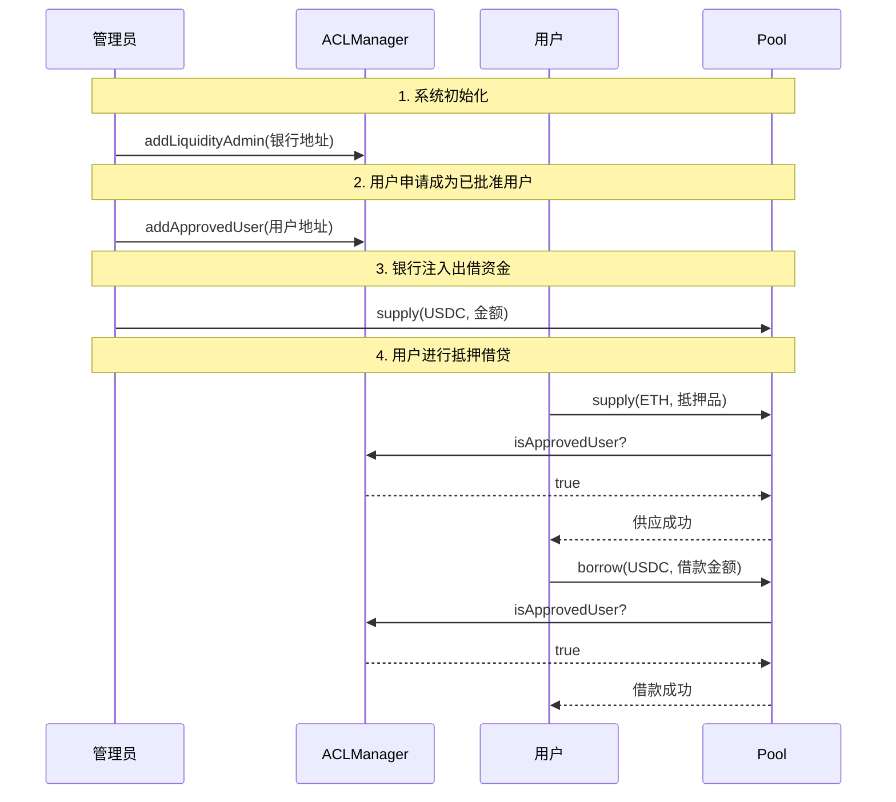
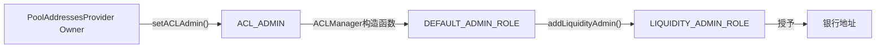

# 银行自营借贷系统完整方案

## 业务背景

### 目标场景

将 Aave V3 改造为**银行对客户的借贷系统**：

- **银行**是唯一的资金来源（不接受公众存款作为借贷资金）
- **用户**必须通过准入后才能抵押借贷
- **收益**（利息）归银行所有

### 业务模型




### 资产分类

- **出借资产**（如 USDC、USDT）- `borrowingEnabled = true`
- 谁能存入：仅银行（LIQUIDITY_ADMIN_ROLE）
- 用途：银行出借给用户
- **抵押资产**（如 ETH、BTC）- `borrowingEnabled = false`
- 谁能存入：仅已批准用户（APPROVED_USER_ROLE）
- 用途：用户存入作为借款担保

## 权限设计

### 角色体系




### 角色说明

#### LIQUIDITY_ADMIN_ROLE（流动性管理员）

```javascript
┌─────────────────────────────────────────────────────────────┐
│  LIQUIDITY_ADMIN_ROLE                                       │
├─────────────────────────────────────────────────────────────┤
│  持有者    │  银行地址                                       │
│  权限      │  供应出借资产（borrowingEnabled=true 的资产）    │
│  管理者    │  DEFAULT_ADMIN_ROLE                             │
│  用途      │  银行向协议注入可借出的资金（如 USDC）           │
└─────────────────────────────────────────────────────────────┘
```


#### APPROVED_USER_ROLE（已批准用户）

```javascript
┌─────────────────────────────────────────────────────────────┐
│  APPROVED_USER_ROLE                                         │
├─────────────────────────────────────────────────────────────┤
│  持有者    │  已通过准入的用户                               │
│  权限      │  ① 供应抵押资产（borrowingEnabled=false）       │
│            │  ② 借款（borrow）                               │
│  管理者    │  POOL_ADMIN_ROLE                                │
│  用途      │  标识合法的已批准用户，进行抵押借贷业务         │
└─────────────────────────────────────────────────────────────┘
```


#### 角色对比

```javascript
操作类型              所需角色                    资产条件
────────────────────────────────────────────────────────────
供应出借资产    →    LIQUIDITY_ADMIN_ROLE       borrowingEnabled=true
供应抵押资产    →    APPROVED_USER_ROLE         borrowingEnabled=false  
借款            →    APPROVED_USER_ROLE         N/A
```


### 权限判断流程



---

## 代码改动（8个文件，约100行）

### 阶段一：流动性提供者限制（待完成）

#### 1. IACLManager.sol - LIQUIDITY_ADMIN_ROLE 接口

**文件**: [src/contracts/interfaces/IACLManager.sol](src/contracts/interfaces/IACLManager.sol)

```solidity
function LIQUIDITY_ADMIN_ROLE() external view returns (bytes32);
function addLiquidityAdmin(address admin) external;
function removeLiquidityAdmin(address admin) external;
function isLiquidityAdmin(address admin) external view returns (bool);
```


#### 2. ACLManager.sol - LIQUIDITY_ADMIN_ROLE 实现

**文件**: [src/contracts/protocol/configuration/ACLManager.sol](src/contracts/protocol/configuration/ACLManager.sol)

```solidity
bytes32 public constant override LIQUIDITY_ADMIN_ROLE = keccak256('LIQUIDITY_ADMIN');

function addLiquidityAdmin(address admin) external override {
  grantRole(LIQUIDITY_ADMIN_ROLE, admin);
}

function removeLiquidityAdmin(address admin) external override {
  revokeRole(LIQUIDITY_ADMIN_ROLE, admin);
}

function isLiquidityAdmin(address admin) external view override returns (bool) {
  return hasRole(LIQUIDITY_ADMIN_ROLE, admin);
}
```


#### 3. Errors.sol - CallerNotLiquidityAdmin

**文件**: [src/contracts/protocol/libraries/helpers/Errors.sol](src/contracts/protocol/libraries/helpers/Errors.sol)

```solidity
error CallerNotLiquidityAdmin();
```


#### 4. ValidationLogic.sol - 出借资产检查

**文件**: [src/contracts/protocol/libraries/logic/ValidationLogic.sol](src/contracts/protocol/libraries/logic/ValidationLogic.sol)

```solidity
function validateSupply(..., address sender, IACLManager aclManager) internal view {
  // ... 现有验证 ...
  if (reserveCache.reserveConfiguration.getBorrowingEnabled()) {
    require(aclManager.isLiquidityAdmin(sender), Errors.CallerNotLiquidityAdmin());
  }
}
```


#### 5. SupplyLogic.sol / Pool.sol - 传递 ACLManager

已修改 `executeSupply` 和 `supply/supplyWithPermit/deposit` 传递 ACLManager。---

### 阶段二：用户准入机制（待完成）

#### 1. IACLManager.sol - 添加 APPROVED_USER_ROLE 接口

```solidity
function APPROVED_USER_ROLE() external view returns (bytes32);
function addApprovedUser(address user) external;
function removeApprovedUser(address user) external;
function isApprovedUser(address user) external view returns (bool);
```


#### 2. ACLManager.sol - 实现 APPROVED_USER_ROLE

```solidity
bytes32 public constant override APPROVED_USER_ROLE = keccak256('APPROVED_USER');

// 在 constructor 中设置 POOL_ADMIN_ROLE 为管理员
_setRoleAdmin(APPROVED_USER_ROLE, POOL_ADMIN_ROLE);

function addApprovedUser(address user) external override {
  grantRole(APPROVED_USER_ROLE, user);
}

function removeApprovedUser(address user) external override {
  revokeRole(APPROVED_USER_ROLE, user);
}

function isApprovedUser(address user) external view override returns (bool) {
  return hasRole(APPROVED_USER_ROLE, user);
}
```


#### 3. Errors.sol - 添加 CallerNotApprovedUser

```solidity
error CallerNotApprovedUser(); // Caller is not an approved user
```


#### 4. ValidationLogic.sol - 完善权限检查

**validateSupply** - 添加抵押资产检查：

```solidity
if (reserveCache.reserveConfiguration.getBorrowingEnabled()) {
  require(aclManager.isLiquidityAdmin(sender), Errors.CallerNotLiquidityAdmin());
} else {
  // 新增：抵押资产只允许已批准用户供应
  require(aclManager.isApprovedUser(sender), Errors.CallerNotApprovedUser());
}
```

**validateBorrow** - 添加用户检查（需修改函数签名）：

```solidity
function validateBorrow(
  // ... existing params ...
  address borrower,
  IACLManager aclManager
) internal view {
  require(aclManager.isApprovedUser(borrower), Errors.CallerNotApprovedUser());
  // ... existing validation ...
}
```


#### 5. BorrowLogic.sol - 传递 ACLManager

```solidity
function executeBorrow(..., IACLManager aclManager) external {
  ValidationLogic.validateBorrow(..., params.onBehalfOf, aclManager);
}
```


#### 6. Pool.sol - borrow 传递 ACLManager

```solidity
function borrow(...) public virtual override {
  BorrowLogic.executeBorrow(
    ...,
    IACLManager(ADDRESSES_PROVIDER.getACLManager())
  );
}
```

---

## 业务流程

### 完整准入流程



---

## 银行地址配置

银行地址通过 `ACLManager.addLiquidityAdmin(bankAddress)` 进行配置，由 `DEFAULT_ADMIN_ROLE` 持有者调用。

### 权限链路




### 配置步骤

**Step 1: 部署阶段**（在 ACLManager 部署后）

```solidity
// 由 DEFAULT_ADMIN_ROLE 持有者执行
IACLManager aclManager = IACLManager(addressesProvider.getACLManager());
aclManager.addLiquidityAdmin(BANK_ADDRESS);  // 银行地址
```

**Step 2: 验证配置**

```solidity
require(aclManager.isLiquidityAdmin(BANK_ADDRESS), "Bank not configured");
```


### 运维要点

1. **唯一性保证**：部署流程中仅调用一次 `addLiquidityAdmin()`，只传入银行地址
2. **权限保护**：`DEFAULT_ADMIN_ROLE` 通常由治理合约或多签钱包持有
3. **变更流程**：如需更换银行地址，先 `removeLiquidityAdmin(oldBank)`，再 `addLiquidityAdmin(newBank)`

### 参考示例

现有集成测试 `tests/integration/BankLendingSystem.t.sol` 已展示正确配置方式：

```solidity
// 创建银行账户
bank = makeAddr('BANK');

// 由 poolAdmin (DEFAULT_ADMIN_ROLE) 授权
vm.prank(poolAdmin);
aclManager.addLiquidityAdmin(bank);
```


### 部署脚本建议

建议在部署脚本中添加配置步骤，可参考以下伪代码：

```solidity
// deploy-config.sol 或部署脚本中
address constant BANK_ADDRESS = 0x...;  // 银行钱包地址

function configureBankLending() external {
    IACLManager aclManager = IACLManager(
        addressesProvider.getACLManager()
    );
    
    // 配置银行为唯一流动性管理员
    aclManager.addLiquidityAdmin(BANK_ADDRESS);
    
    // 验证配置
    require(
        aclManager.isLiquidityAdmin(BANK_ADDRESS),
        "Bank configuration failed"
    );
}


```