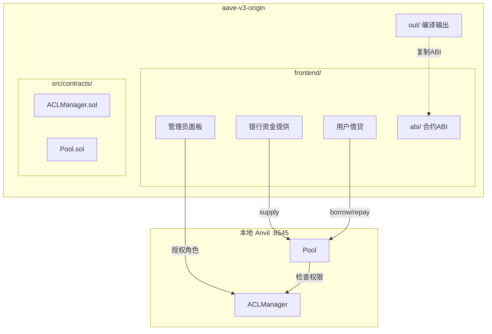

# 银行借贷前端集成到 aave-v3-origin 项目

## 目录结构

```javascript
aave-v3-origin/
├── src/contracts/           # 智能合约（已存在）
├── out/                     # 编译输出（已存在）
├── frontend/                # 新建前端目录
│   ├── src/
│   │   ├── abi/            # 从 ../out/ 复制的 ABI
│   │   ├── components/     # React 组件
│   │   ├── hooks/          # 自定义 hooks
│   │   ├── config/         # 合约地址配置
│   │   ├── App.tsx
│   │   └── main.tsx
│   ├── package.json        # 独立的依赖管理
│   ├── vite.config.ts
│   ├── tailwind.config.js
│   └── tsconfig.json
├── package.json             # 原有配置（不修改）
└── ...
```


## 实现步骤

### 1. 创建前端项目基础

在 `/Users/albert/Desktop/web3/aave-v3-origin/frontend/` 目录下初始化 Vite + React + TypeScript 项目。核心依赖：

- wagmi + viem（区块链交互）
- @rainbow-me/rainbowkit（钱包连接）
- @tanstack/react-query（数据管理）
- tailwindcss（样式）

### 2. 配置合约 ABI

从 `out/` 目录提取必要的 ABI 文件：

- `out/ACLManager.sol/ACLManager.json` -> ABI 提取
- `out/Pool.sol/Pool.json` -> ABI 提取
- `out/MintableERC20.sol/MintableERC20.json` -> ERC20 ABI

### 3. 配置 wagmi 和本地链

配置 `frontend/src/config/` 连接本地 Anvil (localhost:8545)，设置合约地址。

### 4. 实现核心组件

| 组件模块 | 功能 ||---------|------|| AdminPanel | 授权/撤销 LIQUIDITY_ADMIN_ROLE 和 APPROVED_USER_ROLE || BankSupply | 银行提供借贷资金（需 LIQUIDITY_ADMIN 权限） || UserLending | 用户抵押、借款、还款（需 APPROVED_USER 权限） |

### 5. 更新根目录配置

在根目录 [.gitignore](.gitignore) 添加前端相关忽略规则（node_modules 等）。

## 架构图




## 开发工作流

```bash
# 终端 1: 启动 Anvil 并部署（在项目根目录）
anvil --host 0.0.0.0 --port 8545

# 终端 2: 部署合约
forge script scripts/DeployAaveV3MarketBatched.sol --rpc-url http://localhost:8545 --broadcast

# 终端 3: 启动前端开发服务器
cd frontend && npm run dev


```